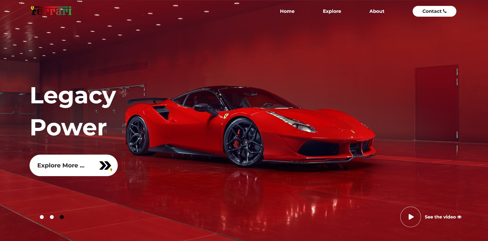

# Ferrari Landing Page
## Dv By KARIM 

## Intro 
Welcome to the Ferrari Landing Page, the final project in the ALX Software Engineering course, focusing on frontend development. This project showcases the beauty and performance of Ferrari cars through a visually stunning and interactive web experience. Built using ReactJS and Vite, the landing page features a responsive design, captivating video backgrounds, and engaging animations. Explore the world of Ferrari and experience the thrill of luxury sports cars like never before.

## Features
- Responsive design for mobile and desktop
- Video background with auto-play and loop
- Interactive navigation menu
- Hero section with text animations
- Contact section with a phone icon

## Technologies Used
- ReactJS
- Vite
- HTML5
- CSS3
- Font Awesome for icons

## Usage of useEffect
The `useEffect` hook is used in this project for various purposes, such as loading data asynchronously, updating the document title, and managing side effects. The `useEffect` hook is used to ensure that certain code runs only after the component has rendered.

