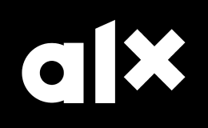
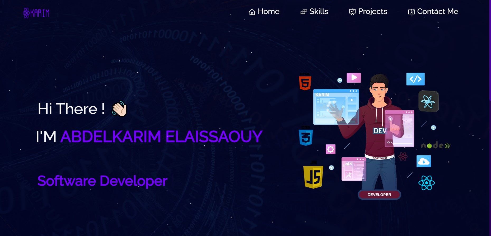

  

---

> [!NOTE]
> This README provides an overview of my latest projects, the Webstack ReactJS Portfolio and the Ferrari Landing Page, demonstrating my skills in frontend development.
> - **ReactJS**: ReactJS is a JavaScript library for building user interfaces. Its component-based architecture makes it easier to manage complex UIs by breaking them down into reusable and composable components. ReactJS also offers a virtual DOM for efficient rendering, allowing for faster updates and better performance.
> - **Vite**: Vite is a modern build tool for frontend development. It offers lightning-fast development and build times by leveraging native ES modules in the browser. With Vite, developers can enjoy near-instantaneous hot module replacement (HMR), quick server start times, and optimized production builds. It's a game-changer for modern web development workflows.

---
# Welcome to Karim's Webstack Portfolio!

Hello, I'm Karim, a Full Stack Developer & Software engineer and a graduate of the ALX Software Engineering . Here, I showcase two of my projects that highlight my skills in frontend development using ReactJS.

## Webstack Portfolio with ReactJS

My Webstack ReactJS Portfolio is a representation of my journey in software development. Built with ReactJS, CSS3, Bootstrap, Font Awesome, and Lb.js, this portfolio offers a responsive design for both mobile and desktop users. Explore my projects, learn about my skills, and get in touch for collaborations or opportunities.

### Portfolio Features

- **Responsive Design**: Seamlessly adapts to various screen sizes.
- **Projects Showcase**: Explore my projects with live demos and details.
- **Skills Highlight**: Discover my expertise in various technologies.
- **Contact Form**: Reach out to me easily for collaborations or inquiries.

### Technologies Used

- **ReactJS**: A powerful JavaScript library for building user interfaces.
- **CSS3**: The latest in styling techniques for beautiful designs.
- **Bootstrap**: A popular CSS framework for responsive and mobile-first design.
- **Font Awesome**: A vast collection of icons to enhance user experience.
- **JSlibraries**: Lightweight JavaScript library for scroll-based animations.

## Ferrari Landing Page

As a final project in the ALX Software Engineering course, I developed the Ferrari Landing Page. This project showcases the beauty and performance of Ferrari cars through an interactive web experience. Built using ReactJS and Vite, it features a responsive design, captivating video backgrounds, and engaging animations. Dive into the world of Ferrari and experience the thrill of luxury sports cars like never before!

### Ferrari Landing Page Features

- **Responsive Design**: Ensures optimal viewing on various devices.
- **Captivating Videos**: Video backgrounds for an immersive experience.
- **Interactive Navigation**: Seamless navigation through the content.
- **Engaging Animations**: Enhances user interaction and engagement.

### Technologies Used

- **ReactJS**: The foundation for building dynamic and interactive UIs.
- **Vite**: A modern build tool for fast and efficient development.
- **HTML5 & CSS3**: Standard technologies for structuring and styling web content.
- **Font Awesome**: Used for elegant and scalable icons in the design.

Feel free to explore my projects, and let's connect to discuss potential collaborations or projects. Thank you for visiting!

---
